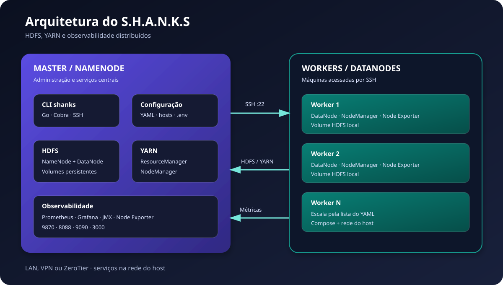
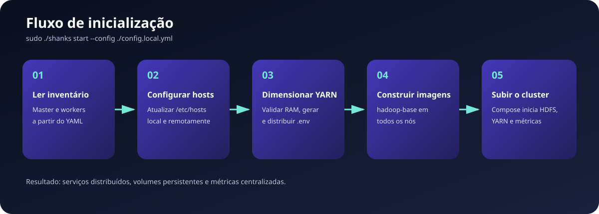

# S.H.A.N.K.S

> Orquestrador de clusters Hadoop distribuídos sobre Docker, com configuração remota por SSH e observabilidade via Prometheus e Grafana.

O **S.H.A.N.K.S** automatiza a preparação e a operação de um cluster Apache Hadoop formado por uma máquina coordenadora (**NameNode/master**) e uma ou mais máquinas de processamento (**DataNodes/workers**). A ferramenta roda no master, lê a topologia de um YAML, configura a resolução de nomes, calcula limites de memória do YARN, cria as imagens Docker e inicia os serviços local e remotamente.

Este guia é voltado a quem deseja instalar, configurar e usar a ferramenta. O projeto está em desenvolvimento; consulte [Limitações conhecidas](#limitações-conhecidas) e [Segurança](#segurança) antes de usá-lo fora de um laboratório.

## Sumário

- [Recursos](#recursos)
- [Arquitetura](#arquitetura)
- [Como funciona](#como-funciona)
- [Tecnologias](#tecnologias)
- [Pré-requisitos](#pré-requisitos)
- [Instalação](#instalação)
- [Configuração](#configuração)
- [Uso da CLI](#uso-da-cli)
- [Portas e interfaces](#portas-e-interfaces)
- [Validação](#validação)
- [Persistência](#persistência)
- [Solução de problemas](#solução-de-problemas)
- [Segurança](#segurança)
- [Limitações conhecidas](#limitações-conhecidas)

## Recursos

- CLI em Go para iniciar, parar, inspecionar e remover o cluster.
- Execução distribuída com Docker Compose em cada máquina.
- HDFS com NameNode e DataNodes.
- YARN com ResourceManager e NodeManagers.
- Limite de memória do YARN configurável por nó.
- Atualização automática de um bloco gerenciado em `/etc/hosts`.
- Comunicação do master com workers por SSH.
- Persistência do HDFS em volumes Docker.
- JMX Exporter, Node Exporter, Prometheus e dashboards Grafana.
- Painel de saúde no terminal.

## Arquitetura



O master hospeda a CLI, os serviços centrais e a observabilidade. Cada worker hospeda um DataNode e um NodeManager. Os containers usam `network_mode: host`: as portas são publicadas diretamente na rede de cada máquina, sem uma rede Docker isolada entre os nós.

| Local | Componentes |
| --- | --- |
| Master | CLI, NameNode, DataNode local, ResourceManager, NodeManager, Prometheus, Grafana e Node Exporter |
| Worker | DataNode, NodeManager e Node Exporter |
| Todos | Docker Engine, Compose, repositório em `~/S.H.A.N.K.S`, SSH e entradas no `/etc/hosts` |

## Como funciona



Ao executar `sudo ./shanks start --config ./config.local.yml`:

1. A CLI lê o master e os workers do YAML.
2. Cria um bloco com IP e nome de todos os nós.
3. Envia o bloco por SSH e executa `config-hosts-shanks.sh` em cada worker.
4. Atualiza o `/etc/hosts` do master. O conteúdo fica entre `# START S.H.A.N.K.S #` e `# END S.H.A.N.K.S #`.
5. Converte cada `yarn_limit` de GB para MB. Se o pedido exceder a RAM do host, usa 70% da memória detectada.
6. Gera `.env` no master e o distribui aos workers por SCP.
7. Verifica e, quando necessário, constrói `hadoop-base` em cada máquina.
8. Executa o Compose do master e, paralelamente, o Compose dos workers.
9. Os entrypoints geram `core-site.xml`, `hdfs-site.xml`, `yarn-site.xml` e `mapred-site.xml`.
10. Na primeira execução o NameNode é formatado; depois HDFS e YARN são iniciados.

Os dados do HDFS permanecem nos volumes Docker entre um `stop` e outro `start`.

## Tecnologias

| Tecnologia | Uso |
| --- | --- |
| Go 1.25 | CLI e coleta de saúde |
| Cobra | Comandos `start`, `stop`, `health` e `prune` |
| Bubble Tea + Lip Gloss | Interface no terminal |
| `x/crypto/ssh` | Execução remota |
| YAML v3 | Leitura do inventário |
| Docker + Compose | Build e ciclo de vida dos containers |
| Ubuntu 22.04 + OpenJDK 8 | Base de execução |
| Apache Hadoop 3.4.0 | HDFS, YARN e MapReduce |
| Prometheus + Grafana | Métricas e dashboards |
| JMX Exporter 1.6.0 + Node Exporter | Exportação de métricas |
| ZeroTier | Rede virtual opcional |

## Pré-requisitos

O instalador atual é específico para **Ubuntu com APT e systemd**. Execute a preparação em todas as máquinas.

- usuário comum com `sudo` em cada host;
- conectividade IP entre todos os nós e TCP 22 nos workers;
- acesso à internet durante instalação e primeiro build;
- arquitetura suportada pelas imagens usadas;
- pelo menos 1,024 GB em cada `yarn_limit`;
- espaço para imagens Docker e dados HDFS;
- Go compatível com o `go.mod` no master para compilar a CLI.

> A CLI procura a chave privada em `~/.ssh/id_rsa` do usuário que chamou `sudo`. Outro caminho ainda não é configurável.

## Instalação

### 1. Rede

Os IPs do YAML devem ser alcançáveis entre os nós. Se estiverem em redes diferentes, use uma VPN ou ZeroTier:

```bash
sudo zerotier-cli join SEU_NETWORK_ID
sudo zerotier-cli listnetworks
ping -c 3 IP_DO_OUTRO_NO
```

Autorize os membros no painel ZeroTier. O ZeroTier é opcional quando já existe uma rede roteável.

### 2. Instalador em todos os nós

Em uma instalação nova, no home do usuário que administrará o nó:

```bash
cd "$HOME"
curl -fsSLO https://raw.githubusercontent.com/ericsanto/S.H.A.N.K.S/staging/install.sh
chmod +x install.sh
sudo ./install.sh
```

O script:

- atualiza o Ubuntu;
- cria o grupo `shanks`;
- instala `/usr/local/bin/config-hosts-shanks.sh`;
- cria a regra limitada em `/etc/sudoers.d/shanks`;
- instala/inicia ZeroTier;
- instala Docker Engine, Buildx e Compose;
- inclui o usuário no grupo `docker`;
- clona o projeto em `~/S.H.A.N.K.S`.

> O script altera pacotes, grupos, sudoers e serviços. Revise [install.sh](install.sh). Ele espera que `~/S.H.A.N.K.S` ainda não exista.

Saia e entre novamente na sessão para aplicar os grupos, então valide:

```bash
docker --version
docker compose version
zerotier-cli status
groups
```

### 3. SSH do master para os workers

No master:

```bash
ssh-keygen -t rsa -b 4096 -f "$HOME/.ssh/id_rsa"
ssh-copy-id -i "$HOME/.ssh/id_rsa.pub" usuario@IP_DO_WORKER
ssh -i "$HOME/.ssh/id_rsa" usuario@IP_DO_WORKER 'hostname && docker --version'
```

O usuário remoto precisa usar Docker sem `sudo` e executar o helper permitido pelo sudoers:

```bash
ssh usuario@IP_DO_WORKER 'sudo -n /usr/local/bin/config-hosts-shanks.sh </dev/null'
```

Esse último teste pode criar um bloco vazio; o `start` o substitui.

### 4. Compilar a CLI no master

O instalador não compila o binário:

```bash
cd "$HOME/S.H.A.N.K.S"
go mod download
go build -o shanks .
./shanks --help
```

Use uma versão de Go compatível com [go.mod](go.mod), atualmente Go 1.25. Prefira recompilar o binário presente no repositório para a arquitetura do master.

## Configuração

```bash
cd "$HOME/S.H.A.N.K.S"
cp config.yml config.local.yml
```

Exemplo mínimo:

```yaml
cluster:
  namenode:
    user: "usuario-master"
    name: "master"
    ip: "10.10.0.10"
    yarn_limit: "2.0"

  datanodes:
    - user: "usuario-worker-1"
      name: "datanode1"
      ip: "10.10.0.11"
      yarn_limit: "2.0"
    - user: "usuario-worker-2"
      name: "datanode2"
      ip: "10.10.0.12"
      yarn_limit: "4.0"
```

| Campo | Descrição |
| --- | --- |
| `namenode.user` | Usuário local do master |
| `namenode.name` | Nome do master; a configuração atual espera `master` |
| `namenode.ip` | IP alcançável do master |
| `namenode.yarn_limit` | Memória do YARN em GB, como string |
| `datanodes[].user` | Usuário da conexão SSH |
| `datanodes[].name` | Nome lógico do worker |
| `datanodes[].ip` | IP alcançável do worker |
| `datanodes[].yarn_limit` | Memória do YARN em GB |

### Alvos do Prometheus

Os alvos ainda são estáticos. Edite [new_cluster/master/prometheus.yml](new_cluster/master/prometheus.yml):

- master: portas `9404`, `9405` e `9100`;
- workers: portas `9406`, `9407` e `9100`.

Sem isso, o Hadoop pode funcionar, mas os dashboards exibirão métricas ausentes ou incorretas.

## Uso da CLI

Execute na raiz `~/S.H.A.N.K.S`. Hoje o `sudo` é necessário para alterar o `/etc/hosts` local; a CLI recupera o home original por `SUDO_USER`.

### Iniciar

```bash
cd "$HOME/S.H.A.N.K.S"
sudo ./shanks start --config ./config.local.yml
```

O primeiro build baixa e compila a base Hadoop em **cada nó** e pode demorar. O NameNode só é formatado quando o volume não contém `current`.

### Saúde

```bash
sudo ./shanks health --config ./config.local.yml
```

Use `↑`/`↓` para navegar e `q` para sair. O painel lê status, CPU e RAM via Docker e HDFS via `dfsadmin -report`. A coleta YARN ainda está desabilitada.

### Parar e preservar dados

```bash
sudo ./shanks stop --config ./config.local.yml
```

Executa `docker compose down` no master e workers, preservando volumes, imagens, `/etc/hosts` e `.env`.

### Remover cluster e dados

```bash
sudo ./shanks prune --config ./config.local.yml
```

> **Perigo:** `prune` usa `docker compose down -v`, remove imagens Hadoop/monitoramento e apaga volumes HDFS/Grafana. Atualmente não pede confirmação. Faça backup.

Nos workers ele também solicita a senha de `sudo` para remover o bloco do `/etc/hosts`.

### Ajuda

```bash
./shanks --help
./shanks start --help
./shanks stop --help
./shanks health --help
./shanks prune --help
```

## Portas e interfaces

| Serviço | Host | Porta | Acesso |
| --- | --- | :---: | --- |
| HDFS NameNode | Master | `9870` | `http://IP_DO_MASTER:9870` |
| HDFS RPC | Master | `9000` | Comunicação interna |
| YARN ResourceManager | Master | `8088` | `http://IP_DO_MASTER:8088` |
| Grafana | Master | `3000` | `http://IP_DO_MASTER:3000` |
| Prometheus | Master | `9090` | `http://IP_DO_MASTER:9090` |
| Node Exporter | Todos | `9100` | Métricas do host |
| JMX NameNode | Master | `9404` | Prometheus |
| JMX ResourceManager | Master | `9405` | Prometheus |
| JMX DataNode | Workers | `9406` | Prometheus |
| JMX NodeManager | Todos | `9407` | Prometheus |
| SSH | Workers | `22` | Administração pela CLI |

Restrinja essas portas por firewall/VPN conforme necessário.

## Validação

```bash
docker ps
ssh usuario@IP_DO_WORKER 'docker ps'
docker exec master hdfs dfsadmin -report
docker exec master yarn node -list
```

Teste de leitura e escrita:

```bash
docker exec master hdfs dfs -mkdir -p /shanks/teste
docker exec master sh -c 'printf "cluster operacional\n" >/tmp/shanks.txt'
docker exec master hdfs dfs -put -f /tmp/shanks.txt /shanks/teste/
docker exec master hdfs dfs -cat /shanks/teste/shanks.txt
```

Teste MapReduce:

```bash
docker exec master hadoop jar \
  /home/hadoop/hadoop/share/hadoop/mapreduce/hadoop-mapreduce-examples-3.4.0.jar \
  teragen 100000 /shanks/teragen
```

Acompanhe em `http://IP_DO_MASTER:8088`.

## Persistência

| Comando | Containers | Volumes | Imagens | `/etc/hosts` | `.env` |
| --- | --- | --- | --- | --- | --- |
| `start` | Cria/inicia | Cria/reutiliza | Constrói | Cria/substitui bloco | Cria/distribui |
| `stop` | Para/remove | Preserva | Preserva | Preserva | Preserva |
| `prune` | Para/remove | **Remove** | **Remove** | Remove bloco | Não remove |

Volumes principais: `master_namenode_data`, `master_namenode_data_datanode`, `master_grafana` e `worker_datanode_data` em cada worker. O Compose pode prefixar seus nomes. Faça backup lógico com `hdfs dfs -get` antes do `prune`.

## Solução de problemas

### Chave privada não encontrada

```bash
ls -l "$HOME/.ssh/id_rsa"
chmod 700 "$HOME/.ssh"
chmod 600 "$HOME/.ssh/id_rsa"
```

### Falha de SSH

```bash
ssh -i "$HOME/.ssh/id_rsa" usuario@IP_DO_WORKER
```

Verifique IP, usuário, porta 22, firewall e `authorized_keys`.

### Docker: `permission denied`

Entre novamente na sessão após o instalador e valide `groups` e `docker ps`.

### Falha no `/etc/hosts`

```bash
sudo visudo -cf /etc/sudoers.d/shanks
sudo -n /usr/local/bin/config-hosts-shanks.sh </dev/null
```

### Grafana sem métricas

Corrija os IPs do `prometheus.yml` e consulte `http://IP_DO_MASTER:9090/targets`.

### `health` não encontra worker

O Compose fixa o container como `worker`, mas o coletor consulta `datanodes[].name`. Se forem diferentes, a coleta falha; veja as limitações.

### Logs

```bash
cd "$HOME/S.H.A.N.K.S/new_cluster/master"
docker compose -f docker-compose.master.yml logs --tail=200

ssh usuario@IP_DO_WORKER \
  'cd "$HOME/S.H.A.N.K.S/new_cluster/worker" && docker compose -f docker-compose.worker.yml logs --tail=200'
```

## Segurança

- O SSH usa `ssh.InsecureIgnoreHostKey()` e não autentica a identidade do host. Use uma rede confiável.
- Não versione `.env`, senhas, inventários reais ou chaves. `new_cluster/ssh` contém material de chave no estado atual: **não o reutilize** e rotacione qualquer chave exposta.
- Restrinja Hadoop, Prometheus, Grafana e exporters por firewall/VPN; `network_mode: host` os expõe conforme as interfaces do host.
- Troque credenciais padrão do Grafana antes de exposição externa.
- Revise o script remoto do instalador e prefira fixar uma tag/commit em vez do branch `staging`.
- `prune` é destrutivo e não possui manifesto para restaurar o estado anterior.

## Limitações conhecidas

- Caminho `~/S.H.A.N.K.S` fixo em todos os nós.
- Instalador específico para Ubuntu/APT, não instala Go e não compila a CLI.
- Chave SSH fixa em `~/.ssh/id_rsa` e porta fixa em 22.
- Validação da chave do host SSH desabilitada.
- Alvos do Prometheus estáticos.
- Worker usa `container_name: worker` e `hostname: datanode_1`, sem derivá-los do inventário; isso pode divergir do `health` e das variáveis YARN.
- YARN fixo em 2 vcores; `spark_limit` não é usado.
- A TUI anuncia `enter` e `r`, mas esses atalhos não estão implementados.
- Coleta YARN do `health` desabilitada.
- `prune` não confirma, não remove `.env` e pode remover imagens compartilhadas.
- Não há rollback se `start` falhar parcialmente.
- O `config.yml` contém uma topologia de desenvolvimento; crie seu arquivo local.

## Estrutura

```text
.
├── main.go                         # entrada da CLI
├── cli/backend/{cmd,models,usecase}
├── tui/                            # painel de saúde
├── new_cluster/
│   ├── Dockerfile.base
│   ├── master/ e worker/
│   ├── scripts/                    # configuração e entrypoints
│   ├── jmx/ e grafana/
├── config.yml                      # inventário de exemplo
├── config-shanks-hosts.sh
├── install.sh
└── docs/images/                    # diagramas
```

## Desenvolvimento e contribuição

```bash
go mod download
gofmt -w main.go cli tui
go test ./...
go vet ./...
go build -o shanks .
```

Não inclua IPs reais, `.env`, binários ou chaves. Em issues, informe SO/arquitetura, versões de Go/Docker/Compose, comando, logs sem segredos e topologia.

## Licença

A CLI em `cli/backend` inclui licença MIT. Consulte [cli/backend/LICENSE](cli/backend/LICENSE). Dependências mantêm suas respectivas licenças.
